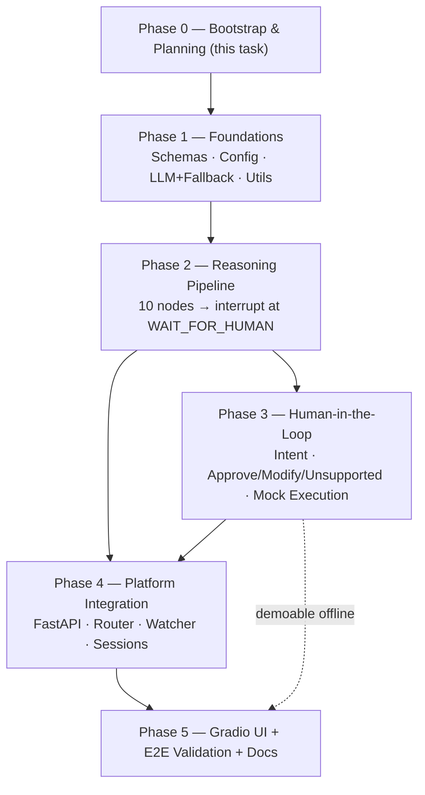

# MASTER_IMPLEMENTATION.md

# Hiring Operations Agent MVP — Engineering Implementation Guide

**Version:** 1.0
**Status:** Approved for phased implementation
**Owner:** Lead Software Engineer
**Authoritative Sources (immutable):**
1. `docs/system_architecture.md` (highest precedence)
2. `docs/product_requirements.md`
3. `docs/system_flow.md`

> This guide **operationalizes** the approved documents into an executable
> phase plan. It does **not** redesign, rename, or extend the architecture.
> Where the source docs are silent on a build detail, this guide follows the
> explicit `ASSUMPTION`s already consolidated in `system_flow.md` Appendix A.
> If anything here conflicts with the three source docs, the source docs win.

---

## 1. System Overview

The Hiring Operations Agent is an **AI-native workflow engine** (LangGraph),
not a chatbot. It consumes a standardized **Meeting Package (JSON)** produced
by a mocked Layer 1, reasons over it through a linear evidence-first pipeline,
produces two artifacts — an internal **Operations Package** and a human-facing
**Approval Package** — pauses for **human approval**, and then simulates
downstream enterprise actions via **mock adapters**.

The MVP implements exactly one domain agent (Hiring). The platform must remain
generic enough to accept future domain agents (Engineering, Sales, Customer
Success, Executive) with **no platform redesign**.

Two canonical fixtures drive all validation:

| Fixture | Candidate | Expected shape of outcome |
|---|---|---|
| `meeting_package_strong.json` | Absaar Ali (deep multi-agent/LangGraph fit) | strong recommendation (e.g. Move Forward) |
| `meeting_package_borderline.json` | Meera Krishnan (RAG-strong, multi-agent/governance gaps) | borderline (e.g. Hold / Additional Interview) |

**Non-negotiable principles** (inherited verbatim):
- Agent is a workflow engine; Gradio is presentation only; business logic lives only in the backend.
- Artifact-driven: every node emits one structured, inspectable artifact.
- Human-in-the-loop: no external action without explicit approval.
- Evidence-first: no recommendation without evidence references.
- Schema-first: three governing contracts.
- Per-interview isolated state; no conversational memory.
- Infrastructure may be mocked; architecture may not.

**MVP-specific engineering mandate (from user):** the LLM (Ollama Cloud) is the
primary reasoning engine, but every reasoning/classification node must have a
**deterministic fallback** so the system stays runnable when the LLM is
unavailable (no key, no network, or repeated failures). This is wired as a
first-class concern in Phase 1 and consumed by every later phase.

---

## 2. Component Breakdown

Mapped to `system_architecture.md` §5 and §8. Ownership by phase in brackets.

| # | Component | Responsibility | Phase |
|---|---|---|---|
| C1 | **Data Contracts (schemas/)** | Pydantic models for Meeting / Operations / Approval packages, WorkflowState, Events | P1 |
| C2 | **Config (core/common)** | Typed settings from `.env` (pydantic-settings); paths; LLM mode | P1 |
| C3 | **Common utils (core/common)** | Rich logging, id/timestamp helpers, JSON IO | P1 |
| C4 | **LLM client (core/llm)** | Ollama Cloud provider + deterministic fallback provider; structured-output validation; bounded retry | P1 |
| C5 | **Hiring domain models (agents/hiring/models.py)** | InterviewContext, EvidenceGraph, Findings, Assessment, Decision, ActionPlan, Drafts | P2 |
| C6 | **Reasoning nodes (agents/hiring/nodes)** | 10 linear nodes: Context Validation → Approval Package Generation | P2 |
| C7 | **Prompts (agents/hiring/prompts)** | One prompt template per LLM reasoning node | P2 |
| C8 | **Package generators (agents/hiring/services)** | Operations Package + Approval Package assembly; evidence-first enforcement | P2 |
| C9 | **Workflow graph (agents/hiring/workflow.py + core/workflow)** | LangGraph StateGraph, checkpointer, interrupt/resume, stage transitions | P2/P3 |
| C10 | **HITL nodes (agents/hiring/nodes)** | Intent Classification, Approve, Modify, Unsupported | P3 |
| C11 | **Modification router** | Earliest-affected-node resume + downstream-only regeneration | P3 |
| C12 | **Mock Execution (core/execution)** | ATS/tracker, email, Teams adapters + execution logs + failure modelling | P3 |
| C13 | **FastAPI Gateway (api/)** | main, dependencies, middleware; health + hiring routers; stub routers for pluggability | P4 |
| C14 | **File Watcher (core/watcher)** | Watchdog on `runtime/input`; triggers a workflow session | P4 |
| C15 | **Session manager (core/workflow)** | Create/resume/get-state per `meeting_id`; runtime file lifecycle | P4 |
| C16 | **Renderer (core/renderer + data/templates)** | Jinja2 rendering of email / tracker / markdown views | P5 (templates may seed in P2) |
| C17 | **Gradio UI (frontend/)** | Teams-chat simulation; renders Approval Package; forwards messages | P5 |
| C18 | **Fixtures & expected outputs (data/)** | Runtime dirs, expected_outputs goldens, READMEs | P1 dirs / P5 goldens |

---

## 3. Dependency Graph

**Critical path:** P1 → P2 → P3 → P4 → P5. P4 needs the *complete* graph
(P2 + P3). The deterministic fallback (P1/C4) makes P2 and P3 demoable and
testable **without** the API/UI or a live LLM.

**Internal contract dependency (must hold before coding a node):**
`schemas` (C1) is the hard dependency for every reasoning artifact; nothing in
P2+ may invent an artifact shape not first defined as a schema/model.

---

## 4. Implementation Strategy

1. **Architecture-first, schema-first.** Define every data contract before the
   logic that produces it. A node is not "started" until its input/output
   models exist.
2. **Fallback-first execution.** Build C4 so `LLM_MODE=fallback` yields a
   complete, coherent (if generic) run with zero network. Every subsequent
   phase is validated in fallback mode *first*, then against the live LLM.
3. **One phase at a time, gated by approval.** Implement a phase, run its
   validation checklist, update `TRACKER.md`, then **stop and wait** for user
   approval before the next phase (see `AGENTS.md` → Implementation Workflow).
4. **Node names and order are frozen.** Names from `system_flow.md` §7 and the
   order in Diagram 3 are authoritative and must not be renamed or reordered.
5. **Preserve the folder structure** from `system_architecture.md` §8 exactly.
6. **Keep the UI dumb.** All logic in the backend; Gradio only renders the
   Approval Package and forwards messages.
7. **Small, reviewable commits** within each phase; no cross-phase scope
   bleed. Ask before any deviation.

**Fewer, larger, reviewable phases:** the graph is split at its natural seam —
the `WAIT_FOR_HUMAN` interrupt. P2 is everything *before* the human; P3 is
everything *after*. Platform wiring (P4) and presentation (P5) are separated so
backend correctness is proven before any UI exists.

---

## 5. Risks & Mitigations

| # | Risk | Impact | Mitigation | Phase |
|---|---|---|---|---|
| R1 | LLM unavailable (no key / no network / rate limit / outage) | Workflow can't reason | **Deterministic fallback** for every reasoning + classification node; `LLM_FALLBACK_ENABLED` degrades on retry-exhaustion (explicit user requirement) | P1 |
| R2 | Model returns malformed / non-schema output | Node fails or emits garbage | Structured (schema-constrained) outputs + Pydantic validation + bounded retry with error fed back; then fallback | P1/P2 |
| R3 | Ollama Cloud endpoint semantics (OpenAI-compatible `/v1` vs native client) uncertain | Wrong integration | Isolate all LLM I/O behind C4 provider interface; verify against `.env` host in a P1 smoke test; swap provider without touching nodes | P1 |
| R4 | LangGraph interrupt/resume + **modification resume** (earliest-affected-node, downstream-only regen) is the subtlest logic | Wrong artifacts / full restarts | Follow `system_flow.md` §12 mapping exactly; assert upstream artifacts unchanged after modify; dedicated tests per resume target | P2/P3 |
| R5 | Evidence-first violated (recommendation without evidence refs) | Breaks core principle | Central evidence-enforcement helper; reject+regenerate ungrounded findings/decisions (Assumption 3) | P2 |
| R6 | Scope drift / redesign temptation | Architecture violation | Phase gates + AGENTS workflow + "ask, don't decide" rule | all |
| R7 | Windows path / file-watch quirks | Runtime bugs | `pathlib` everywhere; Watchdog tested on Windows; atomic file moves | P4 |
| R8 | Concurrent sessions leak state | Isolation broken | Per-`meeting_id` isolated LangGraph state + thread_id; 2-fixture isolation test | P4 |
| R9 | `glm-5.2` model name / availability on the account | Live runs fail | Model is env-driven (`OLLAMA_MODEL`); fallback covers absence; confirm with user if live run needed | P1 |

---

## 6. Validation Strategy

- **Per-phase validation checklists** (Section 8) are the gate to the next phase.
- **Unit tests (pytest)** for schemas, config, LLM fallback, evidence enforcement, intent mapping, modification routing.
- **Fixture-driven runs:** every phase that can execute the graph is run against **both** canonical fixtures.
- **Golden expected outputs:** `data/fixtures/expected_outputs/` captures reference Approval Packages (produced in fallback mode for determinism) for regression.
- **Fallback-mode gate:** every phase must pass with `LLM_MODE=fallback` (offline, deterministic) *before* any live-LLM claim is made.
- **Manual E2E walkthrough** (P5): drop fixture → review in UI → approve / modify / unsupported → execution.
- **Behavioural differentiation check:** strong vs borderline fixtures must yield *different* recommendations — proof the reasoning is real, not templated.

---

## 7. Phase Breakdown (Summary)

> Phases are numbered 1–5. Phase 0 (this task) is repository bootstrap +
> planning and is not an implementation phase. Detailed per-phase spec follows.

| Phase | Title | Natural seam |
|---|---|---|
| 0 | Repository Bootstrap & Planning *(this task)* | env, deps, planning docs |
| 1 | Foundations: Contracts, Config, LLM + Deterministic Fallback | schema-first bedrock |
| 2 | LangGraph Reasoning Pipeline (→ interrupt at WAIT_FOR_HUMAN) | everything before the human |
| 3 | Human-in-the-Loop: Intent, Approve/Modify/Unsupported, Mock Execution | everything after the human |
| 4 | Platform Integration: FastAPI, Router, Watcher, Sessions | make it a service |
| 5 | Gradio UI + End-to-End Validation + Docs | make it usable + prove it |

---

## 8. Phase Specifications

### Phase 0 — Repository Bootstrap & Planning *(this task — not an implementation phase)*

**Goal.** Prepare the repository and the engineering plan without writing any application logic.
**Deliverables.** `.venv` (no packages installed); `requirements.txt`; `.env.example`; `.gitignore`; `Implementation_docs/MASTER_IMPLEMENTATION.md`; `Implementation_docs/TRACKER.md`; `AGENTS.md` Implementation Workflow section.
**Dependencies.** Approved source docs; existing fixtures + hiring tracker.
**Success Criteria.** Plan reviewed; environment reproducible; no application code written.
**Validation Checklist.**
- [x] All three source docs + AGENTS.md read and treated as immutable
- [x] Fixtures, tracker, candidate profiles analyzed
- [x] Planning docs created; phases defined
- [x] Bootstrap files created; venv present, no packages installed
- [x] AGENTS.md appended (existing content untouched)

---

### Phase 1 — Foundations: Data Contracts, Config, LLM Client + Deterministic Fallback

**Goal.** Lay the schema-first bedrock: the three data contracts + WorkflowState + Events, typed configuration, common utilities, and the LLM client with a working deterministic fallback. Establish the backend package skeleton and runtime directories. **No hiring reasoning yet.**

**Deliverables.**
- Backend package skeleton per `system_architecture.md` §8 (`backend/api`, `backend/core/{workflow,llm,execution,watcher,renderer,common}`, `backend/agents/hiring/{nodes,prompts,services}`, `backend/schemas`, `backend/tests`) with `__init__.py`s.
- `data/runtime/{input,processing,operations,approvals,completed,logs}/` and `data/fixtures/expected_outputs/`, `data/templates/` (with `.gitkeep`).
- `schemas/meeting_package.py`, `operations_package.py`, `approval_package.py`, `workflow_state.py`, `events.py` (Pydantic v2), mirroring `system_flow.md` §8 and §14.1.
- `core/common/`: `config.py` (pydantic-settings reading `.env`), `logging.py` (Rich), `ids.py`, `json_io.py`, `paths.py`.
- `core/llm/`: `base.py` (provider interface + structured-output contract), `ollama_provider.py` (Ollama Cloud), `fallback_provider.py` (deterministic), `client.py` (mode selection + bounded retry + validation), retry policy per `system_flow.md` §15.
- Fixture validation: both meeting packages parse into `MeetingPackage`.
- `pytest` unit tests: schema round-trip, config load, fallback determinism, retry-then-fallback.

**Dependencies.** Phase 0.

**Success Criteria.**
- Config loads every `.env` var with typed defaults; missing optional keys don't crash.
- Both fixtures validate against `MeetingPackage` with zero errors.
- `LLM_MODE=fallback` returns valid, schema-conformant structured objects with **no network**.
- LLM client retries on transient error, then degrades to fallback when `LLM_FALLBACK_ENABLED=true`.

**Validation Checklist.**
- [ ] Schemas cover all fields in `system_flow.md` §8.1, §8.2, and the full WorkflowState table §14.1
- [ ] `MeetingPackage` validates both fixtures; rejects a deliberately malformed one
- [ ] Config maps all `.env.example` keys; `LLM_MODE` ∈ {cloud, fallback}
- [ ] Deterministic fallback provider produces valid structured output offline
- [ ] Structured-output validator rejects bad output and triggers retry
- [ ] Folder structure matches `system_architecture.md` §8
- [ ] `pytest` green

---

### Phase 2 — LangGraph Reasoning Pipeline (Context Validation → Approval Package Generation)

**Goal.** Implement the 10 linear reasoning nodes and compile the LangGraph graph up to the `WAIT_FOR_HUMAN` interrupt, producing a valid Operations Package and Approval Package. Evidence-first enforced end to end.

**Deliverables.**
- `agents/hiring/models.py`: InterviewContext, EvidenceGraph (+ EvidenceNode/EvidenceRef), Findings, Assessment, Decision, ActionPlan, Drafts.
- `agents/hiring/nodes/`: `context_validation.py`, `context_analysis.py`, `evidence_graph.py`, `issue_identification.py`, `operational_assessment.py`, `decision_synthesis.py`, `action_planning.py`, `draft_generation.py`, `operations_package.py`, `approval_package.py`.
- `agents/hiring/prompts/`: one prompt per LLM node (Context Analysis → Draft Generation).
- `agents/hiring/services/`: `operations_package_generator.py`, `approval_package_generator.py`, `evidence.py` (evidence-first enforcement).
- `agents/hiring/workflow.py`: `StateGraph` wiring CV→CA→EG→II→OA→DS→AP→DG→OPG→APG → `interrupt` at `WAIT_FOR_HUMAN`; failure edge from Context Validation → FAILED/Rejected.
- `core/workflow/`: checkpointer setup (in-memory/SQLite), stage-transition helpers, retry policy integration.
- Dev runner (`backend/tests/` or `scripts/run_pipeline.py`) that loads a fixture and runs to interrupt, dumping the Approval Package JSON.

**Dependencies.** Phase 1 (all schemas, config, LLM+fallback).

**Success Criteria.**
- Strong fixture → valid `ApprovalPackage` JSON, `approval_status="pending"`, `execution_status="not_started"`, interrupt reached.
- Every finding and the decision carry evidence references.
- Malformed package → `Rejected` terminal, no reasoning runs.
- `workflow_stage` values match `system_flow.md` Appendix B at each node.
- Strong vs borderline fixtures produce differentiated assessments/recommendations.

**Validation Checklist.**
- [ ] Node order and names match Diagram 3 / §7 exactly (no renames)
- [ ] Each node writes its artifact + `workflow_stage` per Appendix B
- [ ] Evidence-first: ungrounded findings/decisions rejected + regenerated
- [ ] Interrupt fires at `WAIT_FOR_HUMAN`; state persists across the pause
- [ ] Full pipeline completes offline in `LLM_MODE=fallback`
- [ ] Strong ≠ borderline outcome (behavioural differentiation)
- [ ] Malformed package → Rejected; empty transcript rejected
- [ ] `pytest` green

---

### Phase 3 — Human-in-the-Loop: Intent Classification, Approve / Modify / Unsupported, Mock Execution

**Goal.** Complete the resume half of the graph: classify the human message, route to Approve / Modify / Unsupported, implement earliest-affected-node modification resume with downstream-only regeneration, and the mock execution engine.

**Deliverables.**
- `agents/hiring/nodes/`: `intent_classification.py`, `approve.py`, `modify.py`, `unsupported.py`, `mock_execution.py`.
- Intent classifier: LLM classifier + **deterministic keyword fallback**; sets `intent` and `modification_target` per `system_flow.md` §12 mapping; ambiguous/unresolvable → Unsupported (Assumptions 5, 7).
- Modification routing: re-enter at Decision Synthesis / Action Planning / Draft Generation; preserve upstream artifacts; regenerate downstream only; converge OPG → APG → WAIT.
- `core/execution/`: `ats_adapter.py`, `email_adapter.py`, `teams_adapter.py`, `execution_logger.py`; models adapter success/failure (`system_flow.md` §15.2).
- Graph edges: Intent → {Approve→Mock Execution→END, Modify→resume, Unsupported→WAIT}.
- Events: `HumanMessageReceived`, `WorkflowResumed`, `ExecutionStarted`, `ExecutionCompleted`, `WorkflowCompleted`.

**Dependencies.** Phase 2.

**Success Criteria.**
- "approve" → all 3 mock adapters run, `execution_status="completed"`, `WorkflowCompleted`, graph ends.
- "rewrite the email" → resume at Draft Generation; only drafts + OPG + APG regenerated; upstream untouched; back to WAIT.
- "change recommendation to hold" → resume at Decision Synthesis; downstream regenerated.
- Unsupported message → rejection + still `waiting_approval`, no artifact change.
- Ambiguous message → Unsupported.

**Validation Checklist.**
- [ ] Intent classifier returns exactly one of {Approval, Modification, Unsupported}
- [ ] `modification_target` matches §12 table; unresolved → Unsupported
- [ ] Upstream artifacts provably unchanged after a Modify; only downstream regenerated
- [ ] Approve sets `approval_status="approved"` before execution
- [ ] Mock execution emits Started/Completed + logs; adapter-failure path modelled
- [ ] Deterministic keyword classifier works with LLM off
- [ ] Full approve + modify + unsupported cycles pass offline in fallback mode
- [ ] `pytest` green

---

### Phase 4 — Platform Integration: FastAPI Gateway, Hiring Router, File Watcher, Session Management

**Goal.** Wire the complete graph behind the platform: FastAPI gateway + versioned hiring router, Watchdog file trigger, per-session isolated state, runtime file lifecycle, and event logging.

**Deliverables.**
- `api/main.py`, `api/dependencies.py`, `api/middleware.py`.
- `api/routes/health.py`; `api/routes/hiring.py` (start session, resume with message, get state); **empty stub routers** `engineering.py`, `sales.py`, `customer_success.py` to prove pluggability (registered, no logic).
- `core/watcher/`: Watchdog handler on `runtime/input` → triggers hiring session; atomic move `input → processing`.
- `core/workflow/` session manager: create/resume/get-state keyed by `meeting_id`/thread_id; persist Operations + Approval packages to `runtime/operations` + `runtime/approvals`; move to `completed` on finish; write `runtime/logs`.
- Event emission wired to the logger in the order of `system_flow.md` §15.1.

**Dependencies.** Phases 2 + 3 (the full graph).

**Success Criteria.**
- Dropping a fixture into `runtime/input` creates a session and writes an Approval Package to `runtime/approvals`.
- `GET` session state returns current stage + Approval Package.
- `POST` human message routes through Intent Classification and resumes the graph.
- Two fixtures processed close together keep fully isolated state.

**Validation Checklist.**
- [ ] `/api/v1/agents/hiring` endpoints: start, resume(message), get-state
- [ ] Health endpoint returns ok
- [ ] Watcher detects new file, moves input→processing, persists artifacts, moves to completed
- [ ] Session isolation verified with both fixtures concurrently
- [ ] Stub routers register without affecting platform behaviour (pluggability proof)
- [ ] Events logged in specified order
- [ ] `pytest` + a scripted API E2E pass (fallback mode)

---

### Phase 5 — Gradio Teams-Simulation UI + End-to-End Validation + Docs

**Goal.** Add the presentation layer (no business logic), then validate the whole system end to end on both fixtures and write run docs.

**Deliverables.**
- `frontend/app.py`, `frontend/pages/`, `frontend/components/` (chat, approval panel, evidence view, execution results), `frontend/assets/`.
- UI talks only to the backend API; renders every Approval Package field (`system_flow.md` §8.2); forwards human messages verbatim.
- `core/renderer/` + `data/templates/` Jinja2 templates for email / tracker / markdown views (if not seeded earlier).
- `data/fixtures/expected_outputs/` golden Approval Packages (fallback-mode, deterministic) for both fixtures.
- `README.md` (setup + run instructions, fallback vs cloud), `data/fixtures/meeting_packages/README.md`.

**Dependencies.** Phase 4.

**Success Criteria.**
- End to end: drop fixture → UI shows executive summary / evidence / recommendation / confidence / action items / approval request → approve → execution results shown → workflow completed.
- Modify flow (rewrite email) visibly regenerates and re-renders.
- Unsupported handled with an explanation of supported operations.
- Both fixtures run; strong and borderline produce visibly different recommendations.
- Whole demo runs in `LLM_MODE=fallback` with the LLM off.

**Validation Checklist.**
- [ ] UI renders all Approval Package fields; contains no business logic
- [ ] Approve / Modify / Unsupported all demonstrable from the UI
- [ ] E2E documented in README; both fixtures pass
- [ ] Golden expected outputs captured for regression
- [ ] Demo-safe offline (fallback mode)
- [ ] Live-LLM run confirmed (if user provides/validates the Ollama key + model)
- [ ] `pytest` green

---

## 9. Final Readiness Checklist (whole MVP)

- [ ] All five phases complete and individually approved
- [ ] Both fixtures run end to end (drop → reason → approve → mock execution → completed)
- [ ] Strong vs borderline produce differentiated, evidence-backed recommendations
- [ ] No external action ever fires without explicit approval (HITL proven)
- [ ] Every recommendation carries evidence references (evidence-first proven)
- [ ] Modification resumes at the earliest affected node; upstream artifacts preserved
- [ ] Per-session state isolation proven with concurrent fixtures
- [ ] Entire system runnable offline in `LLM_MODE=fallback`; live Ollama path verified separately
- [ ] Folder structure matches `system_architecture.md` §8; node names/order match `system_flow.md`
- [ ] UI is presentation-only; all business logic in the backend
- [ ] Stub domain routers prove pluggability with no platform redesign
- [ ] `requirements.txt` frozen to a lockfile after first install; README run instructions verified
- [ ] `TRACKER.md` reflects final status for every phase

---

*End of MASTER_IMPLEMENTATION.md*
