# SYSTEM_FLOW.md

# Hiring Operations Agent MVP — Workflow Execution Specification

**Version:** 1.0
**Status:** Final Draft
**Document Type:** Runtime & Workflow Execution Specification
**Authoritative Sources:** `PRODUCT_REQUIREMENTS.md` (v1.0), `SYSTEM_ARCHITECTURE.md` (v1.0)
**Audience:** LangGraph implementation engineers, backend engineers, QA, reviewers

---

## 0. About This Document

This document is the **workflow execution specification** for the Hiring Operations Agent MVP. It converts the already-approved architecture into an executable, node-by-node runtime specification suitable for direct LangGraph implementation.

This document does **not** redesign, rename, extend, or simplify the approved architecture. Where the source documents are silent on a runtime detail, this specification documents an **explicit assumption** rather than introducing new behaviour. Every such assumption is labelled `ASSUMPTION` inline and consolidated in Appendix A.

The governing precedence order is:

1. `SYSTEM_ARCHITECTURE.md`
2. `PRODUCT_REQUIREMENTS.md`
3. This document (`SYSTEM_FLOW.md`)

If any statement here conflicts with the two source documents, the source documents win and this document must be corrected.

### Terminology

The terms **node**, **stage**, and **artifact** are used precisely:

- A **node** is a single unit of execution in the LangGraph workflow.
- A **stage** is the workflow-phase label a node advances the state into (the `workflow_stage` field).
- An **artifact** is a structured, inspectable, testable object produced by a node and consumed by downstream nodes.

---

## 1. Foundational Principles (Restated, Not Redesigned)

These principles are inherited verbatim from the source documents and constrain every decision in this specification.

1. **The agent is a workflow engine, not a chatbot.** LangGraph owns all logic. Gradio is a presentation surface only.
2. **Artifact-driven, not prompt-chaining.** Every node produces a structured artifact; the next node consumes it. Artifacts are inspectable, testable, and reusable.
3. **Human-in-the-loop is mandatory.** No external action executes without explicit human approval.
4. **Evidence-first.** No recommendation may exist without supporting evidence references.
5. **Schema-first data contracts.** Meeting Package, Operations Package, and Approval Package are the three governing contracts.
6. **Per-interview isolated state.** Each Meeting Package owns one independent workflow session; there is no shared or conversational memory in the MVP.
7. **Pluggable domain agents.** Only the Hiring Operations Agent is implemented; the platform must accept future domain agents with no platform redesign.
8. **Infrastructure may be mocked; architecture may not.**

---

## 2. System Context — Two Layers

### Layer 1 — Meeting Intelligence Platform (Mocked)

Layer 1 is entirely mocked in the MVP. It is assumed to have already performed meeting capture, transcript generation, speaker identification, and context assembly, and to have emitted a single standardized **Meeting Package (JSON)**. No Layer 1 component is implemented. The MVP consumes pre-generated Meeting Packages placed into the runtime input directory.

### Layer 2 — AI Operations Platform (Implemented)

Layer 2 hosts independent domain agents. Only the **Hiring Operations Agent** is implemented. It consumes the Meeting Package, executes the LangGraph workflow, produces an Operations Package and an Approval Package, obtains human approval, and simulates downstream execution through mock integrations.

Future domain agents (Engineering, Sales, Customer Success, Executive Operations) are out of scope for the MVP but must remain addable without platform changes.

---

## 3. End-to-End System Flow

The workflow begins the moment a Meeting Package appears in the runtime input directory. The current MVP trigger is the **File Watcher**; the production trigger is an **Event Bus**.

### Diagram 1 — End-to-End System Flow

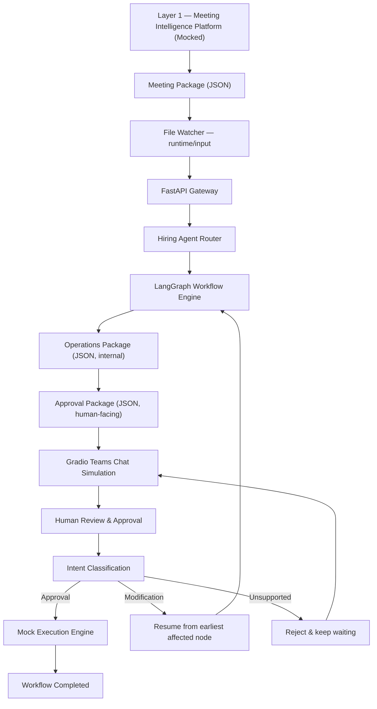

**Reading the flow:** a Meeting Package is detected, routed through FastAPI into the Hiring Agent Router, which instantiates one workflow session. The LangGraph workflow reasons over the package and emits two artifacts. The Approval Package is rendered in the Gradio chat. The human's message is classified into exactly one supported intent, which either completes the workflow (Approval), re-enters the graph at the earliest affected node (Modification), or is rejected while the workflow remains paused (Unsupported).

---

## 4. Runtime Component Flow

The runtime actors and their responsibilities are fixed by the architecture. The File Watcher detects; FastAPI routes and owns the API lifecycle; the Hiring Router creates/resumes workflow instances; LangGraph executes statefully with interrupt/resume; the Approval Package is the approval source of truth; Gradio presents; the Human decides.

### Diagram 2 — Runtime Component Flow

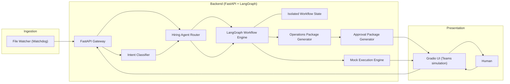

**Note on control:** the Gradio UI never contains business logic. Every human message is sent to FastAPI, classified, and dispatched back into the workflow via the Hiring Router. Presentation and logic never mix.

---

## 5. Workflow Philosophy — Artifact-Driven Execution

Each node consumes upstream artifacts and produces exactly one primary artifact, written into the isolated workflow state. Nodes never mutate artifacts owned by earlier nodes except when the workflow is deliberately resumed at an earlier node during a Modification (Section 12). This property is what makes selective, downstream-only regeneration possible.

The two terminal artifacts are the **Operations Package** (internal, non-editable reasoning record) and the **Approval Package** (human-facing, JSON, the approval source of truth). Markdown is never authoritative; the Approval Package JSON is.

---

## 6. LangGraph Pipeline Overview

The workflow executes in exactly this order. The linear reasoning chain runs from `Context Validation` through `Approval Package Generation`, then the graph **interrupts** at `WAIT_FOR_HUMAN`. On resume, the human message is classified and routed to Approve, Modify, or Unsupported. Approve proceeds to Mock Execution and END; Modify re-enters the graph at the earliest affected node and loops back to `WAIT_FOR_HUMAN`; Unsupported returns to `WAIT_FOR_HUMAN` without state change.

### Diagram 3 — LangGraph Workflow Graph

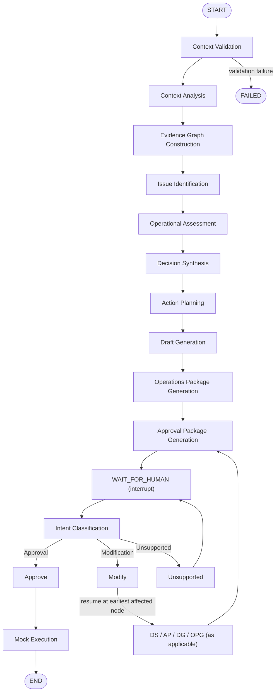

**Failure edges** (not shown for every node to preserve readability) are specified per node in Section 7 and consolidated in Section 15.

---

## 7. Node Specifications

Every node below is specified with: **Purpose**, **Inputs**, **Outputs**, **State Changes**, **Possible Failures**, **Transition Conditions**, **Next Node**, and **Expected Artifact Produced**. Node names are authoritative and must not be renamed.

---

### 7.1 Context Validation

**Purpose.** Validate the incoming Meeting Package before any reasoning occurs. This node is the workflow's structural gatekeeper. It performs no reasoning.

**Inputs.** Raw Meeting Package (JSON) as loaded by the Hiring Router.

**Outputs.** A validated, schema-conformant Meeting Package bound into state, or a validation failure.

**State Changes.** Sets `meeting_package` (validated); sets `workflow_stage = "validated"`; emits `WorkflowStarted` context. On failure, sets `workflow_stage = "failed"` and records the validation error.

**Possible Failures.** Missing required fields; malformed JSON; schema violation (Pydantic validation error); empty transcript or absent candidate/role context. All are terminal for this session (`ASSUMPTION`: the MVP does not attempt auto-repair of malformed packages, consistent with "Reject malformed packages").

**Transition Conditions.** Pass → proceed. Fail → route to FAILED terminal and surface an invalid-package notice.

**Next Node.** Context Analysis (on pass) / FAILED (on fail).

**Expected Artifact Produced.** Validated Meeting Package (bound, immutable for the remainder of the session).

---

### 7.2 Context Analysis

**Purpose.** Understand the hiring context. Understanding only — no reasoning, no judgement, no decisions.

**Inputs.** Validated Meeting Package.

**Outputs.** Structured Interview Context capturing: interview stage, candidate, role, meeting objective, historical context, and tracker state.

**State Changes.** Sets `interview_context`; sets `workflow_stage = "context_analyzed"`.

**Possible Failures.** LLM failure/timeout; unparseable model output; insufficient context to populate required fields. Governed by the retry policy in Section 15.

**Transition Conditions.** Structured Interview Context successfully produced → proceed.

**Next Node.** Evidence Graph Construction.

**Expected Artifact Produced.** Structured Interview Context.

---

### 7.3 Evidence Graph Construction

**Purpose.** Construct the **evidence graph** by building relationships between evidence sources so that every future recommendation can reference concrete evidence. This is **relationship construction, not retrieval**. This node must not be renamed.

**Inputs.** Validated Meeting Package, Structured Interview Context.

**Outputs.** An evidence graph linking Transcript, Resume, Tracker, Interview Notes, Job Description, and Rubric, with referenceable evidence nodes and their relationships.

**State Changes.** Sets `evidence_graph`; sets `workflow_stage = "evidence_constructed"`.

**Possible Failures.** LLM failure; incomplete linking; evidence sources absent from the package (`ASSUMPTION`: absent optional sources are recorded as missing rather than failing the node, feeding "Missing Information" downstream).

**Transition Conditions.** Evidence graph produced with at least the mandatory linkages present → proceed.

**Next Node.** Issue Identification.

**Expected Artifact Produced.** Evidence Graph.

---

### 7.4 Issue Identification

**Purpose.** Surface findings from the evidence graph. No decisions are made here.

**Inputs.** Evidence Graph, Interview Context.

**Outputs.** Findings: Strengths, Weaknesses, Risks, Contradictions, Missing Information, Open Questions.

**State Changes.** Sets `findings`; sets `workflow_stage = "issues_identified"`.

**Possible Failures.** LLM failure; findings not grounded in evidence references (`ASSUMPTION`: ungrounded findings are rejected and regenerated under the retry policy, preserving evidence-first).

**Transition Conditions.** Findings produced and each finding carries evidence references → proceed.

**Next Node.** Operational Assessment.

**Expected Artifact Produced.** Findings.

---

### 7.5 Operational Assessment

**Purpose.** Produce the hiring assessment. Still no actions.

**Inputs.** Findings, Evidence Graph, Interview Context.

**Outputs.** Assessment covering: Suitability, Confidence, Risk, Escalation, Blockers.

**State Changes.** Sets `assessment`; sets `workflow_stage = "assessed"`.

**Possible Failures.** LLM failure; confidence/escalation not derivable from findings.

**Transition Conditions.** Assessment produced → proceed.

**Next Node.** Decision Synthesis.

**Expected Artifact Produced.** Hiring Assessment.

---

### 7.6 Decision Synthesis

**Purpose.** Synthesize the hiring decision from the assessment and evidence.

**Inputs.** Assessment, Findings, Evidence Graph.

**Outputs.** Decision object containing: Recommendation, Alternatives, Confidence, Reasoning, Evidence References. Recommendation values include (non-exhaustive): Move Forward, Reject, Hold, Additional Interview.

**State Changes.** Sets `decision`; sets `workflow_stage = "decision_synthesized"`.

**Possible Failures.** LLM failure; recommendation lacking evidence references (rejected — violates evidence-first); no viable recommendation derivable.

**Transition Conditions.** Decision produced with evidence references → proceed. This node is a **Modification resume entry point** (Section 12).

**Next Node.** Action Planning.

**Expected Artifact Produced.** Decision (with Evidence References).

---

### 7.7 Action Planning

**Purpose.** Translate the decision into concrete operational tasks.

**Inputs.** Decision, Assessment, Interview Context.

**Outputs.** Action Plan with tasks such as: Tracker Update, Candidate Email, Notify Hiring Manager, Schedule Interview.

**State Changes.** Sets `action_plan`; sets `workflow_stage = "actions_planned"`.

**Possible Failures.** LLM failure; actions inconsistent with the decision.

**Transition Conditions.** Action Plan produced → proceed. This node is a **Modification resume entry point**.

**Next Node.** Draft Generation.

**Expected Artifact Produced.** Action Plan.

---

### 7.8 Draft Generation

**Purpose.** Generate the human-consumable draft communications and update proposals for the planned actions.

**Inputs.** Action Plan, Decision, Interview Context, Evidence Graph.

**Outputs.** Draft Email, Tracker Update Proposal (draft materials that will be surfaced for approval).

**State Changes.** Sets `drafts`; sets `workflow_stage = "drafts_generated"`.

**Possible Failures.** LLM failure; drafts referencing actions not present in the Action Plan.

**Transition Conditions.** Drafts produced → proceed. This node is a **Modification resume entry point** (e.g., "Rewrite email").

**Next Node.** Operations Package Generation.

**Expected Artifact Produced.** Draft Communications (Draft Email, Tracker Update Proposal).

---

### 7.9 Operations Package Generation

**Purpose.** Assemble the internal reasoning artifact from all upstream artifacts. Non-editable; never surfaced for human editing.

**Inputs.** Interview Context, Evidence Graph, Findings, Assessment, Decision, Action Plan, Draft Communications.

**Outputs.** Operations Package (JSON, internal).

**State Changes.** Sets `operations_package`; sets `workflow_stage = "operations_package_generated"`; emits `OperationsPackageGenerated`.

**Possible Failures.** Assembly failure; missing upstream artifact (indicates an upstream node did not complete).

**Transition Conditions.** Operations Package assembled → proceed. This node is a **Modification resume convergence point**: all modification paths re-flow through here.

**Next Node.** Approval Package Generation.

**Expected Artifact Produced.** Operations Package.

---

### 7.10 Approval Package Generation

**Purpose.** Derive the human-facing approval artifact from the Operations Package. This artifact is the **approval source of truth**.

**Inputs.** Operations Package.

**Outputs.** Approval Package (JSON) containing: Executive Summary, Recommendation, Confidence, Evidence, Decisions, Action Items, Draft Email, Tracker Updates, Approval Status, Human Comments, Execution Status.

**State Changes.** Sets `approval_package`; sets `workflow_stage = "waiting_approval"`; sets `approval_package.approval_status = "pending"` and `execution_status = "not_started"`; emits `ApprovalPackageGenerated` then `WaitingForApproval`.

**Possible Failures.** Rendering/serialization failure; Operations Package missing.

**Transition Conditions.** Approval Package produced → interrupt.

**Next Node.** WAIT_FOR_HUMAN.

**Expected Artifact Produced.** Approval Package.

---

### 7.11 WAIT_FOR_HUMAN (Interrupt)

**Purpose.** Pause the workflow and hold state until a human message arrives. LangGraph persists the interrupted state; the workflow performs no work while waiting.

**Inputs.** Approval Package (rendered by Gradio).

**Outputs.** None until resumed; on resume, the raw human message is captured for classification.

**State Changes.** On resume, sets `human_feedback` (raw message) and emits `HumanMessageReceived` then `WorkflowResumed`.

**Possible Failures.** None intrinsic to waiting. (`ASSUMPTION`: no MVP timeout — the session waits indefinitely, consistent with single-user, no-auth simplifications.)

**Transition Conditions.** A human message is received → proceed to Intent Classification.

**Next Node.** Intent Classification.

**Expected Artifact Produced.** Captured human message (bound to `human_feedback`).

---

### 7.12 Intent Classification

**Purpose.** Classify every human message into exactly one supported intent. This is the sole gateway between the human and the workflow — no message bypasses it.

**Inputs.** `human_feedback` (raw message), current Approval Package (for context).

**Outputs.** Classified `intent` ∈ {Approval, Modification, Unsupported}; for Modification, the inferred **earliest affected node**.

**State Changes.** Sets `intent`; for Modification, sets the resume target (`ASSUMPTION`: stored as `modification_target` for the router).

**Possible Failures.** LLM failure; ambiguous message (`ASSUMPTION`: ambiguity resolves to Unsupported, which safely keeps the workflow waiting rather than acting).

**Transition Conditions.** Intent = Approval → Approve. Intent = Modification → Modify. Intent = Unsupported → Unsupported.

**Next Node.** Approve / Modify / Unsupported.

**Expected Artifact Produced.** Intent classification result (and resume target when applicable).

---

### 7.13 Approve

**Purpose.** Confirm human approval and hand control to execution.

**Inputs.** Classified intent = Approval; Approval Package.

**Outputs.** Approval Package with `approval_status = "approved"`.

**State Changes.** Sets `approval_package.approval_status = "approved"`; records human comments if present; `workflow_stage = "executing"`.

**Possible Failures.** None beyond state persistence errors.

**Transition Conditions.** Always proceeds to Mock Execution.

**Next Node.** Mock Execution.

**Expected Artifact Produced.** Approved Approval Package.

---

### 7.14 Modify

**Purpose.** Route a modification request back into the graph at the **earliest affected node** without restarting the workflow and without creating a separate edit workflow. This is a core design principle (Section 12).

**Inputs.** Classified intent = Modification; inferred resume target; Approval Package; existing artifacts.

**Outputs.** Re-entry into the graph at the resume target; only downstream artifacts are regenerated.

**State Changes.** Records the human modification request into `human_feedback`; preserves all artifacts upstream of the resume target; marks downstream artifacts for regeneration; keeps `approval_status = "pending"`.

**Possible Failures.** Resume target not resolvable (falls back to Unsupported — `ASSUMPTION`).

**Transition Conditions.** Re-enter at Decision Synthesis, Action Planning, or Draft Generation (as applicable), then re-flow through Operations Package Generation and Approval Package Generation back to WAIT_FOR_HUMAN.

**Next Node.** The resolved resume node.

**Expected Artifact Produced.** Regenerated downstream artifacts; refreshed Operations Package and Approval Package.

---

### 7.15 Unsupported

**Purpose.** Reject any request outside the supported operational intents and explain what is supported.

**Inputs.** Classified intent = Unsupported.

**Outputs.** A rejection message enumerating supported operations (Approve / Modify).

**State Changes.** None to artifacts; `approval_status` remains `pending`; `workflow_stage` remains `waiting_approval`.

**Possible Failures.** None.

**Transition Conditions.** Always returns to WAIT_FOR_HUMAN.

**Next Node.** WAIT_FOR_HUMAN.

**Expected Artifact Produced.** None (no state mutation beyond the outgoing message).

---

### 7.16 Mock Execution

**Purpose.** Simulate downstream enterprise actions after approval. No real external side effects occur.

**Inputs.** Approved Approval Package, Action Plan, Draft Communications.

**Outputs.** Execution results for each mock adapter: ATS/Tracker Update, Candidate Email, Teams Notification, plus execution logs.

**State Changes.** Sets `execution_status` progressively (`in_progress` → `completed`); updates `approval_package.execution_status`; emits `ExecutionStarted` then `ExecutionCompleted`; on success emits `WorkflowCompleted` and `workflow_stage = "completed"`.

**Possible Failures.** Simulated adapter failure (Section 15) — even though mocked, failures are modelled so production adapters can reuse the same handling path.

**Transition Conditions.** All mock adapters report success → END. Any adapter failure → execution-failure handling.

**Next Node.** END (on success) / failure handling (on adapter failure).

**Expected Artifact Produced.** Execution Results & Logs; finalized Approval Package.

---

## 8. Artifact Contracts

### 8.1 Operations Package (Internal)

The Operations Package is the internal reasoning record. It is generated only by the agent, is **not user-editable**, and is never surfaced for direct human editing. It contains:

| Field | Source Node |
|---|---|
| Context Analysis | Context Analysis |
| Evidence Graph | Evidence Graph Construction |
| Findings | Issue Identification |
| Assessment | Operational Assessment |
| Decisions | Decision Synthesis |
| Action Plan | Action Planning |
| Draft Communications | Draft Generation |

### 8.2 Approval Package (Human-Facing)

The Approval Package is the **approval source of truth**, stored as JSON and rendered in the UI. Markdown is never authoritative. It contains:

| Field | Meaning |
|---|---|
| Executive Summary | Human-readable synthesis of the recommendation |
| Recommendation | The synthesized hiring recommendation |
| Confidence | Confidence score/level for the recommendation |
| Evidence | Evidence references backing the recommendation |
| Decisions | Decision record with reasoning |
| Action Items | Concrete operational tasks awaiting approval |
| Draft Email | Draft candidate/stakeholder communication |
| Tracker Updates | Proposed tracker/ATS update(s) |
| Approval Status | `pending` → `approved` (or `rejected`) |
| Human Comments | Free-text human feedback captured during review |
| Execution Status | `not_started` → `in_progress` → `completed`/`failed` |

The Approval Package is regenerated (never hand-edited) whenever a Modification re-flows through Approval Package Generation.

---

## 9. Human Approval Lifecycle

When the workflow reaches `WAIT_FOR_HUMAN`, LangGraph interrupts and persists state. Gradio renders the Approval Package so the human can review the Executive Summary, Evidence, Assessment, Recommendation, Confidence, and Action Items inside the chat and approval panel. The workflow does no work while paused.

The human's response is captured verbatim, then classified. The workflow resumes only through Intent Classification — there is no path by which a human message reaches execution without classification.

### Diagram 4 — Workflow Lifecycle State Diagram

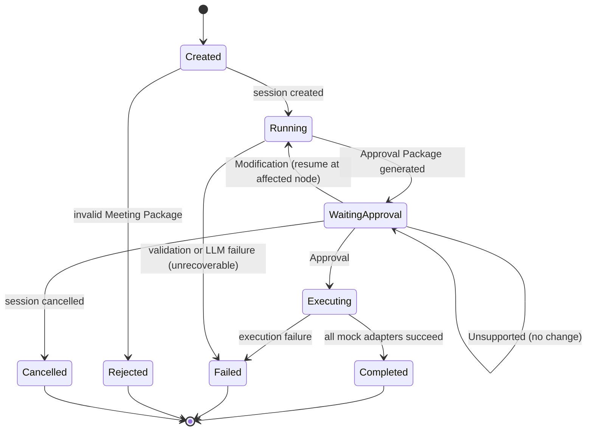

`ASSUMPTION` — `Rejected`, `Cancelled`, and `Failed` are the alternative terminal branches named in the brief. `Rejected` is reached on invalid Meeting Package; `Cancelled` covers explicit session termination (no MVP UI trigger is specified, so it is documented as a supported terminal state only); `Failed` is reached on unrecoverable validation, LLM, or execution failure.

---

## 10. Intent Routing

Every user message follows the identical path: message → Intent Classifier → exactly one of Approval, Modification, Unsupported. The classifier's output alone determines the next workflow node.

### Diagram 8 — Intent Routing Flow

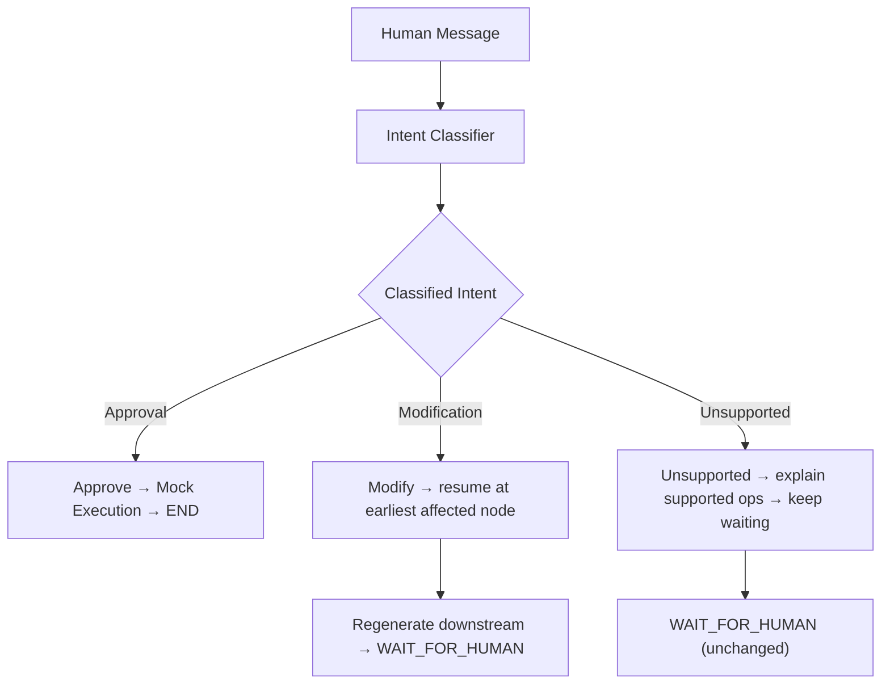

Supported intent examples (from Product Requirements §9): **Approval** — Approve, Execute, Proceed, Approve all. **Modification** — Rewrite email, Change recommendation, Remove tracker update, Update action item. **Unsupported** — everything else.

---

## 11. Approval Intent Flow

On Approval, the workflow resumes, marks the Approval Package approved, executes the mock integrations, and completes.

### Diagram 6 — Approval Flow

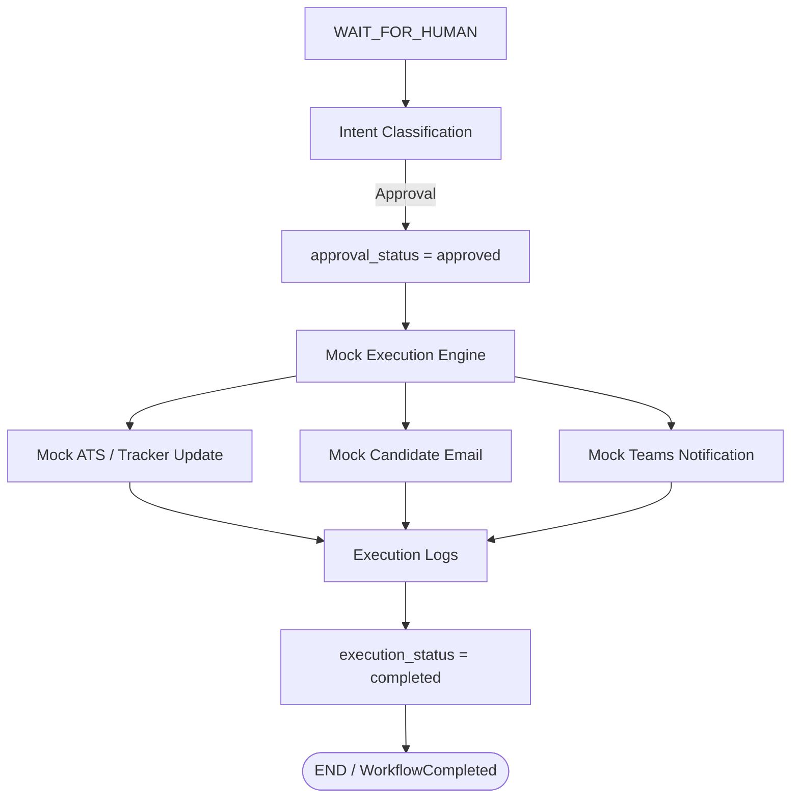

---

## 12. Modification Intent Flow (Core Design Principle)

A Modification **must not** restart the workflow and **must not** spawn a separate edit workflow. Instead, the workflow resumes from the **earliest affected node**, regenerates only downstream artifacts, refreshes the Operations Package and Approval Package, and returns to `WAIT_FOR_HUMAN`.

The two anchor examples fixed by the brief:

- **Rewrite email** → resume at **Draft Generation** → regenerate affected artifacts → update Operations Package → update Approval Package → `WAIT_FOR_HUMAN`.
- **Modify recommendation** → resume at **Decision Synthesis** → regenerate downstream artifacts only → `WAIT_FOR_HUMAN`.

### Modification Target Mapping

`ASSUMPTION` — the source documents specify the resume-at-earliest-affected-node behaviour and two concrete anchors but do not enumerate a full modification-type→node table. The mapping below is derived from those anchors and the pipeline ordering, and is offered as the implementation default. The Intent Classifier infers the resume target; this table is the deterministic fallback.

| Modification request (example) | Earliest affected node (resume target) | Regenerated downstream |
|---|---|---|
| Change recommendation | Decision Synthesis | Action Planning → Draft Generation → Operations Package → Approval Package |
| Add / remove / change action item | Action Planning | Draft Generation → Operations Package → Approval Package |
| Remove tracker update | Action Planning | Draft Generation → Operations Package → Approval Package |
| Rewrite / retone email | Draft Generation | Operations Package → Approval Package |

All modification paths **converge** on Operations Package Generation → Approval Package Generation → WAIT_FOR_HUMAN. Artifacts upstream of the resume target are preserved untouched.

### Diagram 7 — Modification Flow

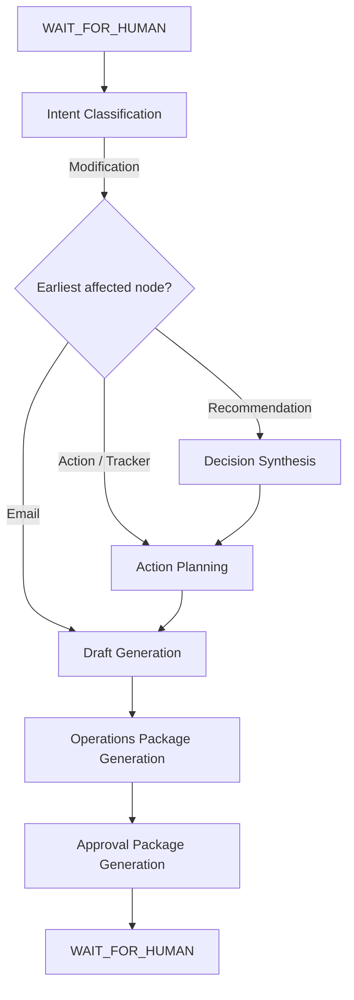

---

## 13. Unsupported Intent Flow

An Unsupported request is rejected with an explanation of supported operations (Approve, Modify). No artifact changes; the workflow remains paused at `WAIT_FOR_HUMAN`. This guarantees the agent never behaves as an open-domain chatbot and never takes action on out-of-scope input.

---

## 14. Workflow State & Session Management

### 14.1 Complete LangGraph State

Each Meeting Package owns one isolated LangGraph state object. The complete state is defined below. Every field is scoped to a single interview session; there is no shared or conversational memory across sessions in the MVP.

| State Field | Description | Written By |
|---|---|---|
| `meeting_package` | Validated input contract (immutable after validation) | Context Validation |
| `interview_context` | Structured Interview Context | Context Analysis |
| `evidence_graph` | Constructed evidence relationships | Evidence Graph Construction |
| `findings` | Strengths, weaknesses, risks, contradictions, missing info, open questions | Issue Identification |
| `assessment` | Suitability, confidence, risk, escalation, blockers | Operational Assessment |
| `decision` | Recommendation, alternatives, confidence, reasoning, evidence refs | Decision Synthesis |
| `action_plan` | Operational tasks | Action Planning |
| `operations_package` | Internal reasoning artifact | Operations Package Generation |
| `approval_package` | Human-facing approval artifact (source of truth) | Approval Package Generation |
| `workflow_stage` | Current stage label (state-machine position) | Every node |
| `human_feedback` | Captured human message / comments | WAIT_FOR_HUMAN, Modify |
| `intent` | Classified intent (Approval / Modification / Unsupported) | Intent Classification |
| `modification_target` | Resume node for a Modification (`ASSUMPTION`) | Intent Classification |
| `execution_status` | Mock execution progress | Mock Execution |
| `messages` | Ordered chat/interaction record for the session | UI ↔ backend |
| `session_metadata` | Session identity & bookkeeping (meeting_id, timestamps) | Router / engine |

`drafts` (Draft Email + Tracker Update Proposal) is produced by Draft Generation and folded into the Operations Package and Approval Package; it is tracked in state as part of the reasoning artifacts.

### 14.2 Session Model

Each Meeting Package creates exactly one workflow session. Each interview is independent. Workflow state remains isolated per session. There is **no multi-user support** in the MVP. LangGraph manages workflow persistence and interrupt/resume; workflow memory is scoped per interview.

### Diagram 9 — Runtime Session Lifecycle

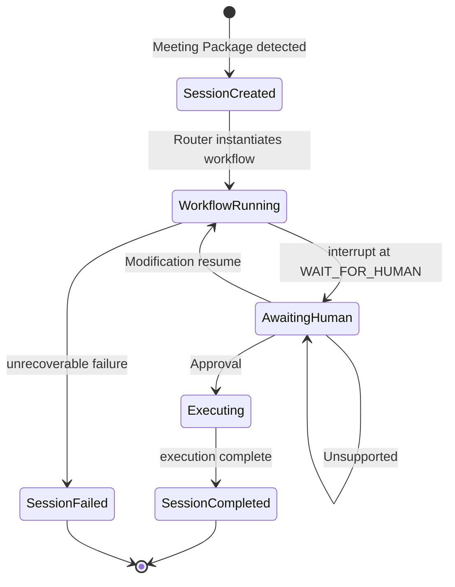

Session isolation guarantee: because state is per-session, two Meeting Packages processed close in time never share artifacts, intent, or execution status.

---

## 15. Event Flow & Failure Handling

### 15.1 Runtime Events

The following events are emitted across a normal run, in order:

`MeetingPackageCreated` → `WorkflowStarted` → `OperationsPackageGenerated` → `ApprovalPackageGenerated` → `WaitingForApproval` → `HumanMessageReceived` → `WorkflowResumed` → `ExecutionStarted` → `ExecutionCompleted` → `WorkflowCompleted`.

`WorkflowFailed` may be emitted from any stage on unrecoverable failure. During a Modification, `HumanMessageReceived` → `WorkflowResumed` recur, followed by a fresh `OperationsPackageGenerated` → `ApprovalPackageGenerated` → `WaitingForApproval` cycle.

### Diagram 5 — Event Flow Sequence Diagram

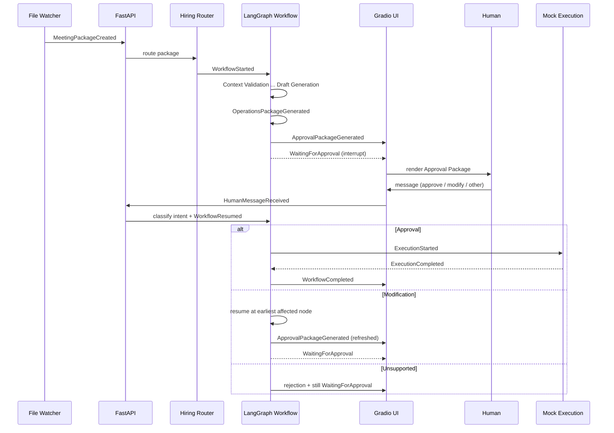

### 15.2 Failure Flows

| Failure | Where | Handling |
|---|---|---|
| Invalid Meeting Package | Context Validation | Reject; terminate session as `Rejected`; surface invalid-package notice. No reasoning runs. |
| Validation Failure (schema) | Context Validation | Same as above — malformed packages are not auto-repaired (`ASSUMPTION`). |
| LLM Failure | Any reasoning node (Context Analysis → Draft Generation, Intent Classification) | Retry under bounded policy; on exhaustion, escalate. |
| Retry Logic | Any LLM node | `ASSUMPTION` — bounded retries with backoff (default 2 retries) on transient LLM/timeout errors; deterministic assembly nodes are not retried the same way. |
| Human Escalation | On retry exhaustion | `ASSUMPTION` — surface a failure notice to the human via the UI and hold the session in `Failed`; no silent auto-progression. |
| Execution Failure | Mock Execution | Even though mocked, adapter failures are modelled: mark `execution_status = failed`, emit `WorkflowFailed`, surface to UI. Production adapters reuse this path. |

**Design intent of failure modelling:** failures are represented at MVP scale so that swapping mock adapters for real enterprise integrations requires no change to the failure-handling topology.

### Diagram — Failure Handling Overview

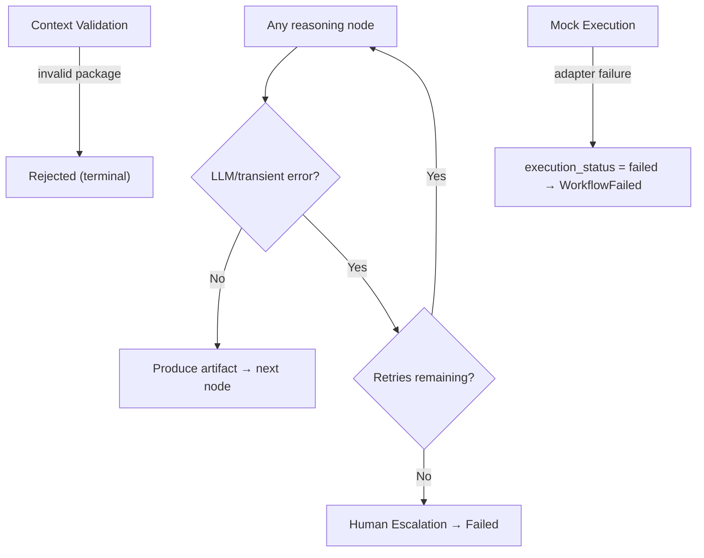

---

## 16. UI Runtime Flow

The Gradio UI, FastAPI, LangGraph, and the Approval Package interact strictly through the backend. The UI renders the Approval Package and forwards human messages; it holds no business logic.

### Diagram — UI Runtime Sequence

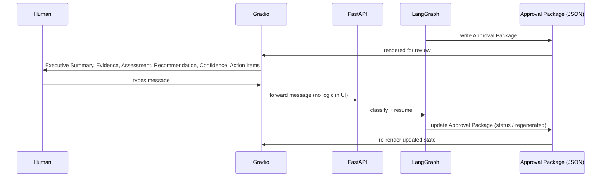

---

## 17. Production Mapping

Every MVP component maps to a production equivalent with no architectural redesign. Only infrastructure changes.

| MVP Component | Production Equivalent |
|---|---|
| File Watcher | Event Bus (Kafka / Azure Service Bus / RabbitMQ / Event Grid) |
| Local JSON storage | Database / Object Storage |
| Gradio Teams simulation | Microsoft Teams |
| Mock Integrations | Enterprise Systems / APIs (ATS, Email, Calendar, Slack, Teams) |
| Local workflow execution | Distributed LangGraph services |
| Single implemented agent | Multiple domain agents (Engineering, Sales, Customer Success, Executive) |

### Diagram 10 — Production Evolution Diagram

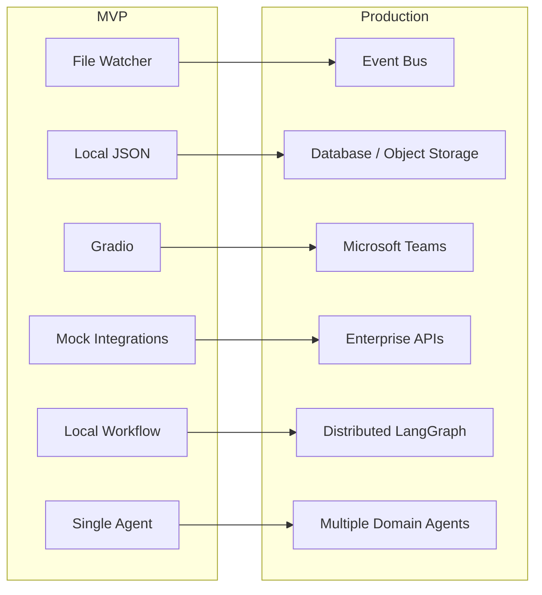

---

## 18. MVP Simplifications (Explicit)

The following simplifications replace **infrastructure only**. The architecture remains production-ready.

- Layer 1 is mocked; Meeting Packages are pre-generated.
- Single implemented domain agent (Hiring Operations Agent).
- Single user; no authentication; no authorization.
- Mock Teams UI (Gradio).
- Mock enterprise integrations.
- Local workflow execution.
- Local JSON storage.
- File Watcher trigger (in place of an Event Bus).
- Infrastructure mocked; architecture production-ready.

---

## Appendix A — Consolidated Assumptions

Each assumption below fills a runtime detail the source documents do not specify. None introduces new architecture, renames a component, or contradicts the source documents.

1. **Malformed packages are not auto-repaired.** Context Validation rejects and terminates; consistent with "Reject malformed packages."
2. **Absent optional evidence sources are recorded as missing** and feed the "Missing Information" finding rather than failing Evidence Graph Construction.
3. **Ungrounded findings/recommendations are regenerated**, never accepted, preserving evidence-first.
4. **`WAIT_FOR_HUMAN` has no MVP timeout**; single-user sessions wait indefinitely.
5. **Ambiguous intent resolves to Unsupported**, keeping the workflow safely paused.
6. **`modification_target` is stored on state** by the Intent Classifier; the Modification Target Mapping (Section 12) is the deterministic fallback.
7. **Unresolvable modification target falls back to Unsupported.**
8. **Bounded LLM retries** (default 2, with backoff) on transient errors; exhaustion escalates to the human and holds the session in `Failed`.
9. **`Cancelled` is a supported terminal state** with no MVP UI trigger specified; documented for lifecycle completeness only.
10. **Execution failures are modelled even though mocked**, so production adapters reuse the identical failure path.

---

## Appendix B — Node → Stage → Artifact Quick Reference

| Node | `workflow_stage` set | Primary Artifact |
|---|---|---|
| Context Validation | validated | Validated Meeting Package |
| Context Analysis | context_analyzed | Structured Interview Context |
| Evidence Graph Construction | evidence_constructed | Evidence Graph |
| Issue Identification | issues_identified | Findings |
| Operational Assessment | assessed | Hiring Assessment |
| Decision Synthesis | decision_synthesized | Decision (w/ evidence refs) |
| Action Planning | actions_planned | Action Plan |
| Draft Generation | drafts_generated | Draft Communications |
| Operations Package Generation | operations_package_generated | Operations Package |
| Approval Package Generation | waiting_approval | Approval Package |
| WAIT_FOR_HUMAN | waiting_approval | Captured human message |
| Intent Classification | (unchanged) | Intent + resume target |
| Approve | executing | Approved Approval Package |
| Modify | waiting_approval (after re-flow) | Regenerated downstream artifacts |
| Unsupported | waiting_approval | (none) |
| Mock Execution | completed | Execution Results & Logs |

---

*End of SYSTEM_FLOW.md*
